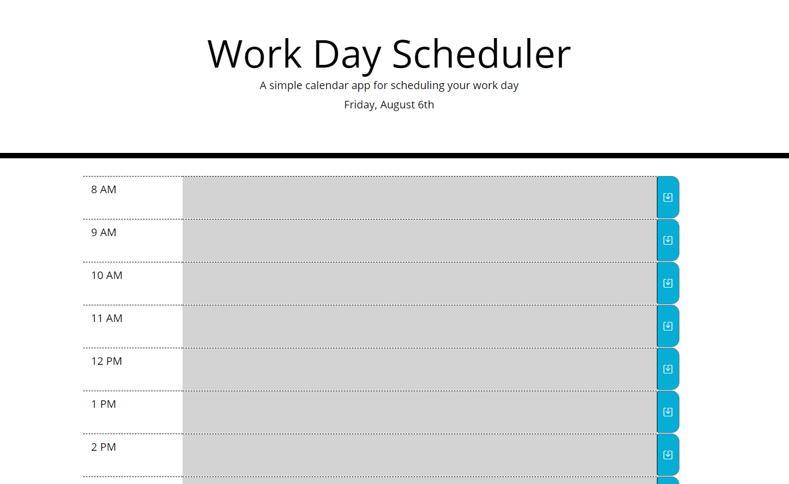

# [Work-Day-Scheduler](https://bcbridges.github.io/Work-Day-Scheduler/) Website

## Description of Project

This project was developed to practice utilizing jQuery, Bootstrap, and the moment.js library. Its main purpose is to provide fields to enter in event information, save those events to local storage, and populate the time with the saved events upon page reload.

### script.js

- The JavaScript in this project utilized jQuery to minimize the amount of code required.
- Comments have been inserted above each function to describe its purpose.
- The Moment library was utilized to display the current date at the top, and to update the background of the timeslots to reflect past, present, and future hours.

## Installation and Access

There is no required software installation necessary to access the code or GitHub published webpage. To access the webpage, either click the 'Work-Day-Scheduler' link at the top of this readme or go to this link https://bcbridges.github.io/Work-Day-Scheduler/.

### Image 1

The index.html can be accessed [here](index.html), the style.css [here](./assets/style.css), and the script.js [here](./assets/script.js).

## License

Copyright (C) 2021 Brice Bridges - the full license can be viewed [here](license.txt)
